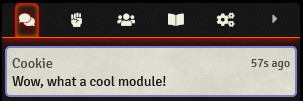

# Hide-Sidebars

Foundry VTT module that allows the GM to hide sidebars (Chat, Scenes, Items, etc) for players, simplifying the player UI. By default it disables Scenes, Items, Tables, Cards, Playlists, and Compendiums.

Each tab can be toggled in the module settings, even the Settings tab. Removing the Settings tab for players is not recommended.
